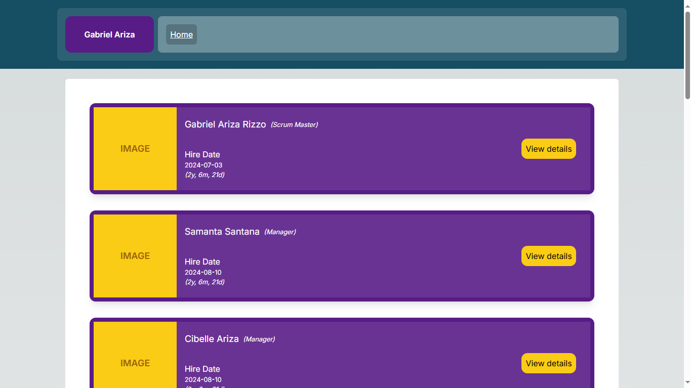
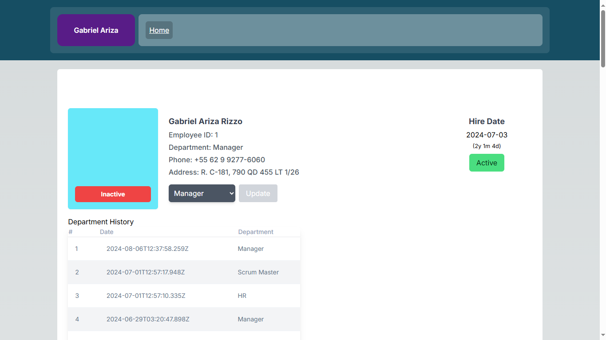

## Simple Employee Maintenance Web Application

### Screenshots





### Overview

The Simple Employee Maintenance web application is designed to streamline the management of employee records and department assignments within an organization. This full-stack application provides essential CRUD operations for employees and departments, alongside a user-friendly interface to view and manage employee information.

### Features

1. **Database Management:**
   - A robust database schema designed using Prisma ORM to store and manage employee and department data.
   - Tables include Employees, Departments, and Employee Department History to track changes over time.

2. **Web Service Endpoints:**
   - **Employee Endpoints:**
     - `GetAllEmployees`: Retrieve a list of all employees.
     - `GetEmployeeById`: Fetch detailed information for a specific employee.
     - `UpdateEmployee`: Modify the details of an existing employee.
     - `DeleteEmployee`: Remove an employee from the system.
   - **Department Endpoints:**
     - `GetAllDepartments`: Retrieve a list of all departments.

3. **Employee List Page:**
   - A web page that displays a comprehensive list of employees, including their names, departments, hire dates, and avatars.
   - Hire dates are displayed in a user-friendly format, indicating the duration of employment.
   - Includes a "View Details" button for each employee to access more detailed information.

### Technical Details

1. **Prisma Schema Definition:**
   - **Department Model:** Contains fields for department ID, unique key, label, and timestamps. It relates to multiple employees and department history records.
   - **Employee Model:** Includes fields for employee ID, unique public ID, first and last names, hire date, department association, phone, address, and timestamps.
   - **Employee Department History Model:** Tracks the history of employees' department assignments, with fields for employee ID, department key, department label, and timestamps.

2. **Technologies Used:**
   - **Backend:** Node.js, with server-side for backend RESTful APIs.
   - **Frontend:** Next.js@14 with React.js@19 implemented the server actions.
   - **Database:** Prisma ORM with SQLite for development database environment.
   - **Other Tools:** Git for version control, GitHub for repository hosting, vercel for deployments.

### Usage

- **Database Setup:** Create the necessary tables and relationships using Prisma migrations.
- **API Development:** Implement the required endpoints to interact with the employee and department data.
- **UI Implementation:** Develop the Employee List page to display and manage employee records effectively.

### Conclusion

The Simple Employee Maintenance web application is a comprehensive solution for managing employee records and departmental assignments, providing an intuitive interface and robust backend to ensure efficient data handling and retrieval.

---

## STARTING POINT

```bash

npm i --force

npm i --legacy-peer-deps

npm i -D jest @types/jest @testing-library/jest-dom ts-jest @testing-library/user-event jest-environment-jsdom @testing-library/react --force

npm run build

npm run test

npm run start

```

## README

A simple web application for managing employee records, built as a fullstack assessment to demonstrate proficiency in software architecture, code quality, design patterns, and best practices.

### Fullstack Assessment – Candidate Instructions

**Expectations**
- Demonstrate a solid and robust architecture.
- Highly maintainable and legible code.
- Use and knowledge of design patterns.
- Follow software development best practices.
- Effective and consistent naming conventions.
- Code crafted with modern development methodologies.
- If you choose to simplify your code in the name of speed (i.e. "prototype" style development) be able to explain the shortcuts you took and why.
- Smart UI patterns are not allowed.
- Code snippets from old projects and/or opening any old projects are strictly forbidden.
- Prioritize good code design and architecture over development speed.
- Read the instructions carefully as only complete and working solutions will be reviewed.
- Your code should compile and run with us doing a simple package restore and nothing more.

**Submitting your code**
- Go to [company-repo-management](https://git.company-repo-management.com) and register or login if you already have an account.
- Create a repository to work on and do constant commits as you would normally do.
- You have no time limit to complete the assessment.
- Once you are ready, add a brief explanation of your solution and architecture to the README file and share your git repository URL with your recruiter.

### Simple Employee Maintenance web app

**First Task (Database):**
Create a database to store the following information:
1. First Name
2. Last Name
3. Hire Date
4. Department
5. Phone
6. Address

Create all needed tables and relationships.

**Second Task (Programming Exercise):**
Create a Web Service that exposes the following endpoints:
1. **For Employee Entity:**
   - Should include the employee department in text form.
   - GetAllEmployees
   - GetEmployeeById
   - UpdateEmployee
   - DeleteEmployee
   
2. **For Department Entity:**
   - GetAllDepartments

**Third Task (Employee List page):**
Create a new page to show a list of employees. You can use the following mockup as reference or create your own design if you prefer.

This page should show the following information:
- Employee Name, Department, Hire Date, Employee Avatar
- It should display the date in the following format: May 2, 2021 (2y – 1m – 4d)
  - The date in parenthesis determines how long that employee has been in the company.
- A "View Details" button that will take the user to the following page.


## Modeling the Database with Prisma

To model the database using Prisma for the requirements you've outlined, we need to define the schema that includes tables for `Employee` and `Department`, and establish the relationships between them. Here’s how you can model it:

### Prisma Schema Definition

Create a new Prisma schema file (typically named `schema.prisma`) and define the schema as follows:

```prisma
// This is your Prisma schema file,
// learn more about it in the docs: https://pris.ly/d/prisma-schema

generator client {
    provider = "prisma-client-js"
}

datasource db {
    provider = "sqlite"
    url      = env("DATABASE_URL")
}

// npx prisma migrate dev

model Department {
    id                        Int                         @id @default(autoincrement())
    key                       String                      @unique
    label                     String
    Employee                  Employee[]
    EmployeeDepartmentHistory EmployeeDepartmentHistory[]
    createdAt                 DateTime                    @default(now())
    updatedAt                 DateTime                    @default(now())

    // @@map("departments")
}

model Employee {
    id                        Int                         @id @default(autoincrement())
    publicId                  String                      @unique @default(uuid())
    firstName                 String
    lastName                  String
    hireDate                  DateTime?                   @default(now())
    isActive                  Boolean
    department                Department?                 @relation(fields: [departmentKey], references: [key])
    departmentKey             String?
    phone                     String
    address                   String
    EmployeeDepartmentHistory EmployeeDepartmentHistory[]
    createdAt                 DateTime                    @default(now())
    updatedAt                 DateTime                    @default(now())

    // @@map("employees")
}

model EmployeeDepartmentHistory {
    id              Int        @id @default(autoincrement())
    employee        Employee   @relation(fields: [employeeId], references: [id])
    employeeId      Int
    department      Department @relation(fields: [departmentKey], references: [key])
    departmentKey   String
    departmentLabel String     @default("")
    createdAt       DateTime   @default(now())
    updatedAt       DateTime   @default(now())

    // @@map("employee_department_history")
}

```
The provided schema defines three models: `Department`, `Employee`, and `EmployeeDepartmentHistory`. Here's an explanation of each model:

1. **Department**:
   - This model represents a department within an organization.
   - It has fields such as `id` (auto-incrementing primary key), `key` (unique string identifier), `label` (department name), and timestamps for `createdAt` and `updatedAt`.
   - It has a one-to-many relationship with the `Employee` model, meaning that a department can have multiple employees.
   - It also has a one-to-many relationship with the `EmployeeDepartmentHistory` model, which tracks the history of employees' department assignments.

2. **Employee**:
   - This model represents an employee within the organization.
   - It has fields such as `id` (auto-incrementing primary key), `publicId` (unique string identifier), `firstName`, `lastName`, `hireDate`, `isActive` (boolean indicating if the employee is currently active), `departmentKey` (foreign key referencing the `key` field in the `Department` model), `phone`, `address`, and timestamps for `createdAt` and `updatedAt`.
   - It has a many-to-one relationship with the `Department` model, meaning that an employee can belong to one department.
   - It has a one-to-many relationship with the `EmployeeDepartmentHistory` model, which tracks the history of the employee's department assignments.

3. **EmployeeDepartmentHistory**:
   - This model keeps track of the history of employees' department assignments.
   - It has fields such as `id` (auto-incrementing primary key), `employeeId` (foreign key referencing the `id` field in the `Employee` model), `departmentKey` (foreign key referencing the `key` field in the `Department` model), `departmentLabel` (the label or name of the department at the time of assignment), and timestamps for `createdAt` and `updatedAt`.
   - It has a many-to-one relationship with both the `Employee` and `Department` models, allowing it to associate an employee with a department at a specific point in time.

This schema allows you to store and manage information about departments, employees, and the history of employees' department assignments within your application. The relationships between the models enable you to query and retrieve data efficiently, such as retrieving all employees belonging to a specific department or retrieving the department history for a particular employee.


### Database Setup

After defining the schema, you would typically run the following commands to generate migrations and apply them to your database:

```bash
npx prisma migrate dev
npx prisma migrate dev --name init

npx prisma migrate up --experimental
```

These commands will create and apply migrations to your database based on the schema you've defined.
